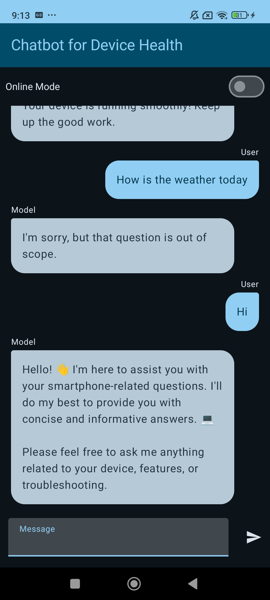
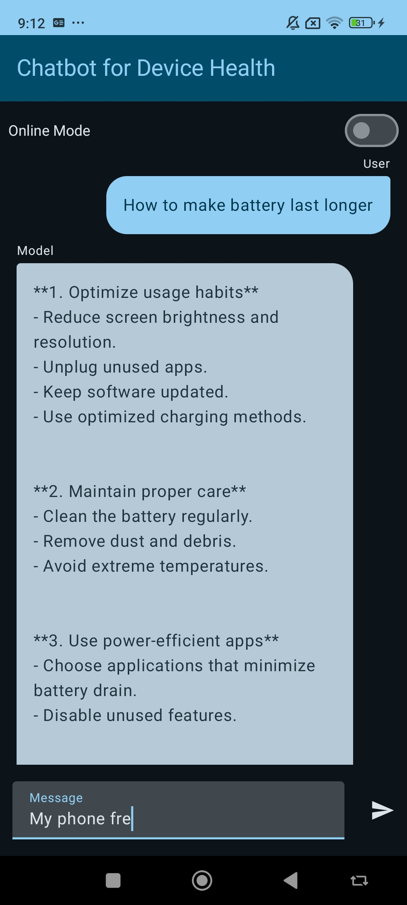
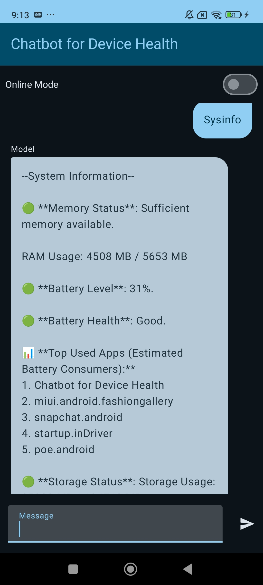

# Offline Mobile Chatbot for Device Health Optimization

## Project Summary

This project involves creating a mobile application that allows users to chat with their smartphone about its health. The app provides personalized recommendations on optimizing device performance, with the key requirement being that it operates entirely offline.


This project is an elaboration on the work of the [MediaPipe LLM Inference Android sample](https://github.com/google-ai-edge/mediapipe-samples/tree/main/examples/llm_inference/android). It extends the original application with additional features and functionality.

## Building and Running the App

Follow these steps to build and run the app on your Android device.

### Prerequisites

- **Android Studio** installed on your machine.
- An **Android device** (physical or emulator) running a supported Android version with preferably 6+ GB of RAM.
- A **Hugging Face account** to obtain an API token.

### Instructions

1. **Clone the Repository**

   Clone this repository to your local machine using the following command:

   ```bash
   git clone https://github.com/kareem5aled/smartphone-bot/
   
2. **Download the Model**

   The app uses the Google's `gemma-1.1-2b-it-tflite` model. Download the model from Kaggle:

   - Visit the model page: [Gemma 1.1 2B IT CPU INT4](https://www.kaggle.com/models/google/gemma/tfLite/gemma-1.1-2b-it-cpu-int4)
   - Download the model file and rename it to `model.bin`.

3. **Place the Model on the Android Device**

   Once you've downloaded the model, place it under the path defined as `MODEL_PATH` in the `InferenceModel` class on the Android device (e.g., `/data/local/tmp/llm/model.bin`).

   **Using Android Studio's Device File Explorer:**

   - Connect your Android device to your computer.
   - Open your project in Android Studio.
   - Navigate to **View > Tool Windows > Device File Explorer**.
   - In the Device File Explorer, navigate to the desired directory (e.g., `/data/local/tmp/llm/`).
     - If the directory doesn't exist, you can create it by right-clicking and selecting **New Directory**.
   - Right-click on the directory and select **Upload**.
   - Choose the `model.bin` file you downloaded and upload it to the device.


4. **Set Up the Hugging Face API Token**

   The app communicates with the Hugging Face API and requires an API token.

   - **Generate a Hugging Face API Token:**
     - Go to the Hugging Face website: [huggingface.co](https://huggingface.co/)
     - Log in to your account or create a new one.
     - Navigate to your profile settings by clicking on your avatar in the top-right corner and selecting **Settings**.
     - Click on **Access Tokens** in the sidebar.
     - Click on **New token** to create a new API token.
     - Give your token a name and select the appropriate scope (e.g., **`read`** permissions are sufficient).
     - Click **Generate new token**.
     - Copy the generated token.

   - **Update `HuggingFaceApi.kt`:**
     - Open the `HuggingFaceApi.kt` file in your project.
     - Locate the following line:

       ```kotlin
       private val apiKey = "hf_xxxxxxxxxxxxxxxxxxxxxxxxx"
       ```

     - Replace `"hf_xxxxxxxxxxxxxxxxxxxxxxxxx"` with your actual API token (keep the quotation marks):

       ```kotlin
       private val apiKey = "hf_your_actual_api_token"
       ```

     - Save the file.

5. **Build and Run the App**

6. **Using the App**

   - Upon launching the app, you should see a welcoming message.
   - You can interact with the app by typing messages into the input field.
   - To retrieve system information, type `'sysinfo'` and send the message.
   - To enable online mode and communicate with a Hugging Face model:
     - Toggle the **Online Mode** switch within the app interface.
     - When online mode is enabled, the app will use the Hugging Face API for responses.
    
#### Offline Usage Examples:
  


- **Permissions:**
  - The app may request certain permissions to function correctly, such as access to device usage stats.
  - Ensure you grant any necessary permissions when prompted then restart the app.


## References

- [MediaPipe LLM Inference Android Sample](https://github.com/google-ai-edge/mediapipe-samples/tree/main/examples/llm_inference/android)
- [Gemma 1.1 2B IT CPU INT4 Model on Kaggle](https://www.kaggle.com/models/google/gemma/tfLite/gemma-1.1-2b-it-cpu-int4)


## Solution Overview

The proposed solutions considered include:

- ❌ **Rule-Based System**: This approach was deemed **unsuitable** due to its **limitations** in handling the extensive variety of potential user inquiries.

- ✅ **LLM-Based System (Large Language Model)**:

  - Provides **extensive knowledge:** can handle wiede variety of user inquries.
  - **Limitations**: On-device use is constrained due to large model sizes and resource demands.

To proceed, the chosen methods to create an offline LLM include:

- **❌ KerasNLP for NLP Tasks**: To provide basic natural language understanding capabilities, recognizing that existing tools like **KerasNLP** only offer completion with **GPT-2** and lack sufficient instruction-following models.

- **❌ ONNX Conversion**: Model conversion to ONNX format for on-device efficiency. Microsoft's Phi-3.5-mini-instruct was tested but found to be too large (>2.5GB) and slow for efficient on-device inference.

- **✅ Google MediaPipe**: MediaPipe Solutions offers tools and libraries for applying AI and ML techniques in applications, with options for customization. It was tested and showed acceptable results. Additionally, it includes Gemma1.1-2b-instruct with int4 quantization, making it fast in inference.

#### The next step involves finding a method to make the scope of the chosen LLM limited to smartphone-related questions. The proposed solutions were:

- **❌Fine-tuning:** The absence of a pre-existing dataset and time constraints made fine-tuning an LLM challenging.
- **❌Prompt Engineering:** Small LLMs struggle to follow instructions accurately and are unreliable without sufficient fine-tuning. Additionally, some models (including Gemma1.1-2b) were not trained with system instructions, making it hard to define the LLM scope to be about smartphones only. 
- **✅Rule-Based approach:** the implmented approach was to only accept user input that contain certian keywords related to smartphones (eg. ram, battery, os, etc.) \
  [https://ai.google.dev/edge/mediapipe/solutions/genai/llm\_inference/android](https://ai.google.dev/edge/mediapipe/solutions/genai/llm_inference/android)

To differentiate between general recommendations and specific details about the user's own device, a keyword-based approach is used. Specific keywords "sysinfo" help determine the nature of the user's inquiry. 

Based on the keyword identification, the chatbot provides insights on device health metrics like RAM usage, storage, and battery, alongside relevant recommendations for optimization.

#### Bonus Feature

An online LLM (Qwen72B-instruct) model is used for online inference, integrated via the Hugging Face API. This was achieved through prompt engineering and the model's substantial capabilities (72 billion parameters). This allows it to generate more rigorous and contextually accurate responses. Additionally, the model automatically detects when the user is asking about their specific device, eliminating the need for predefined keywords (like "sysinfo") by using context to determine the user's intent, while maintaining a natural flow in conversation.

